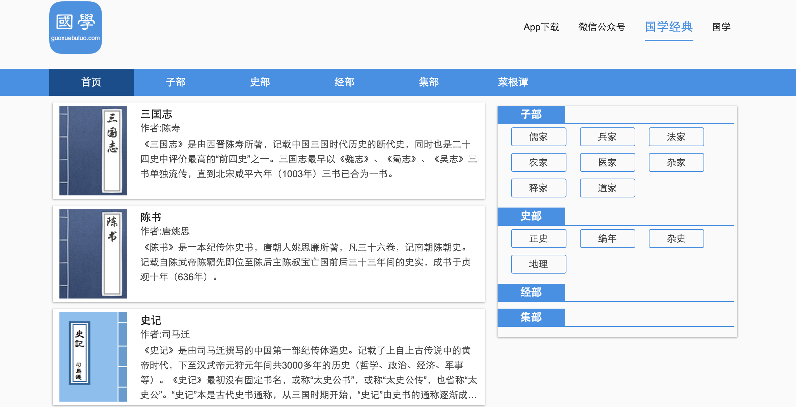

# bookReadDemo
Book reading,Use React.js.

## 说明
1. 项目目录结构用`create-react-app`生成的;
    - [create-react-app](https://github.com/facebookincubator/create-react-app)
    - `npm install -g create-react-app`
    - `create-react-app my-app`
    - `cd my-app`
    - `npm start` 
2. 可以更具自己习惯的结构，直接只拷贝src中的文件即可;
3. 需要安装`yarn`

## 使用
1. 下载：`git clone https://github.com/madeinlife/bookReadDemo.git`
2. 进入项目：`cd bookReadDemo`;
3. 安装库： `yarn install` 或者 `npm install`;
4. 启动项目：`npm start`;
5. build: `yarn run build` 或者 `npm run build`.

### 直接使用
- 进入根目录
- `npm install -g pushstate-server`
- `pushstate-server build`
- 浏览器打开:http://localhost:9000 查看。

## 效果截图

